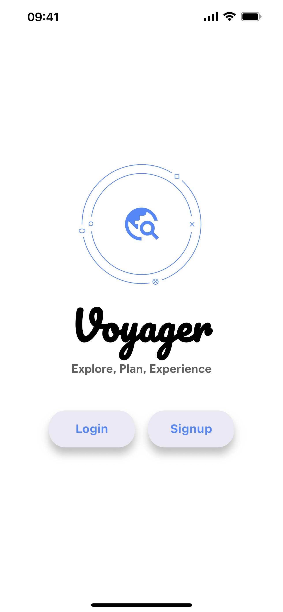
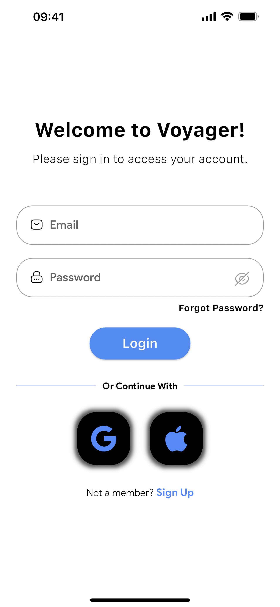

## Voyager - Redefining the Way You Travel

Travel planning can be an exciting yet difficult task, often accompanied by many challenges. From coordinating schedules with travel companions to finding the best transportation options and staying within budget, travellers are faced with a lot of decisions that can make the process overwhelming. In today's fast-paced world, the need for efficient and simplified travel planning tools has never been more crucial. That's where Voyager steps in.

#### Introducing Voyager, Your Ultimate Travel Companion.

Voyager is not just another travel app. It's the way we plan, organise, and experience our journeys. Designed with the modern traveler in mind, Voyager addresses the common pain points and challenges faced during travel planning, offering simple solutions that simplifies the entire process of planning a trip.

## Table of Contents

- [Installation](#installation)
- [Dependencies](#dependencies)
- [Run-locally](#run-locally)
- [Tech Stack](#tech-stack)
- [Features](#features)
- [Screenshots](#screenshots)
- [API Reference](#api-reference)
- [Authors](#authors)
- [FAQ](#faq)

## Installation

Before you can start using this project, you need to set up your environment. Follow these steps for installation and configuration:

**Install Python:**
   
   If you don't already have Python installed on your system, you can download it from the official Python website:

   - [Python Official Website](https://www.python.org/downloads/)

   Please choose the appropriate version (recommended: Python 3.12.0) for your operating system.
    

**Install Dart and Flutter Tools and SDK's:**

   - **Dart SDK:**
   
     If you don't already have Dart SDK installed on your system, you can download it from the official Dart website:
     
     - [Dart SDK](https://dart.dev/get-dart)
     
     Please follow the installation instructions provided on the website.

   - **Flutter Tools and SDK:**
   
     If you don't already have Flutter tools and SDK installed on your system, you can download it from the official Flutter website:
     
     - [Flutter](https://flutter.dev/docs/get-started/install)
     
     Please follow the installation instructions provided on the website.

Once you have completed the installation steps above, follow the instructions in the ```Run Locally``` section for the complete setup required for installation.

## Dependencies

- [**```django```**](https://github.com/django/django)
- [**```pandas```**](https://github.com/pandas-dev/pandas)
- [**```folium```**](https://github.com/python-visualization/folium)
- [**```plotly```**](https://github.com/plotly/plotly.py)

## Run Locally

To run the Voyager project locally, follow these steps:

1. Clone the Git repository:
    ```bash
    git clone https://github.com/ritwikdurga/Voyager.git
    ```
2. Create a file called `.env` in the assets folder.

3. Add the following keys to the `.env` file:
    - `KEY`: Mapbox services key
    - `GEMINI`: Gemini API integration key
    - `FLIGHT_KEY`: Skyscanner Rapid API key
    - `TRAIN_KEY`: IRCTC Rapid API key
    
4. Navigate to the Voyager folder:
    ```bash
    cd Voyager
    ```

5. Navigate to the Voyager_model folder:
    ```bash
    cd Voyager_model
    ```

6. Install the required dependencies using pip:
    ```bash
    pip install -r requirements.txt
    ```

7. Run the Django server:
    ```bash
    python3 manage.py runserver 0.0.0.0:8000
    ```

    This command will start the Django server, listening on all available network interfaces on port 8000.

In the `constants.dart` file, ensure that the IP address is correctly set to match your local environment. This is necessary for proper communication between the Flutter app and the Django server.

8. Open another terminal in the root directory of the project so that the server will keep on running.

9. Run the Flutter app:
    ```bash
    flutter run
    ```

    This command will build and run the Flutter app on your connected device or emulator.


Ensure all steps are followed carefully to successfully run the Voyager project locally.

## Tech Stack

- **Flutter** for frontend development.

- **Firebase** for authentication and database management.

- **Firestore** for data storage and retrieval.

- **Django** for running the AI model locally.

- **Rapid API's** like **IRCTC** and **Sky-Scanner** for real-time transportation data.

- **Mapbox** for complete integration of mapping services.

## Features

- **Explore Destinations**: Discover new destinations dynamically based on user interests and recent searches, making exploration engaging and personalized.
  
- **Search Transportation**: Conduct searches for trains and flights to find the best transportation options, facilitating informed decision-making and simplified integration with trip itineraries. Users can compare timings and prices to plan their trip according to their time and budget constraints.
  
- **Plan Trips**: Craft dream itineraries with flexibility to continue planning existing trips, start fresh with manual trip creation, or utilise our AI-powered itinerary generation, ensuring personalized and optimized travel plans.
  
- **Manage Trips**: Access a centralized hub for managing every aspect of the journey, including essential trip details, collaboration tools, exploration of destinations, detailed itineraries, and real-time expense tracking.
  
- **Profile Management**: Customise your profile information, manage ongoing trips, curate favorite trips, and handle trip invitations. Users can also send feedback about their experience with the app which helps in improving user engagement and facilitating seamless communication and feedback.

## Screenshots

<p float="left">
  
   
  
</p>

## API Reference
### IRCTC API

#### Get Train Fare

```http
  GET /api/v2/getFare?trainNo=${trainNumber}&fromStationCode=${fromStation}&toStationCode=${toStation}
```

| Parameter       | Type     | Description                          |
| :-------------- | :------- | :----------------------------------- |
| `trainNumber`  | `string` | **Required**. Train number for which fare is queried |
| `fromStation`  | `string` | **Required**. Code of the source station |
| `toStation`    | `string` | **Required**. Code of the destination station |

| Header           | Value               |
| :--------------- | :------------------ |
| `X-RapidAPI-Key` | `${TRAIN_KEY}`      |
| `X-RapidAPI-Host`| `irctc1.p.rapidapi.com` |

#### Response:

    {
      "classType1": fare1,
      "classType2": fare2,
      ...
    }

#### Get Trains Between Stations

```http
  GET /api/v3/trainBetweenStations?fromStationCode=${fromStation}&toStationCode=${toStation}&dateOfJourney=${date}
```
| Parameter       | Type     | Description                                         |
| :-------------- | :------- | :-------------------------------------------------- |
| `fromStation`   | `string` | **Required**. Code of the departure station        |
| `toStation`     | `string` | **Required**. Code of the destination station      |
| `date`          | `string` | **Required**. Date of journey in YYYY-MM-DD format |

| Header            | Value                                     |
| :---------------- | :---------------------------------------- |
| `X-RapidAPI-Key` | `${TRAIN_KEY}` (Your RapidAPI Key)        |
| `X-RapidAPI-Host`| `irctc1.p.rapidapi.com`                   |

#### Response:
    {
      "status": true,
      "message": "Success",
      "timestamp": 1680379328922,
      "data": [
        {
          "train_number": "98765",
          "train_name": "Dummy Express",
          "run_days": "Mon,Tue,Wed,Thu,Fri",
          ...
        }
      ]
    }


### SKY SCANNER API

#### Search One Way Flights

```http
  GET https://sky-scanner3.p.rapidapi.com/flights/search-one-way
```
#### Search Round Trip Flights
```http
  GET https://sky-scanner3.p.rapidapi.com/flights/search-roundtrip
```

| Parameter       | Type     | Description                                    |
| :-------------- | :------- | :--------------------------------------------- |
| `fromEntityId`  | `string` | ID of the departure airport                    |
| `toEntityId`    | `string` | ID of the destination airport                  |
| `departDate`    | `string` | Date of departure in `YYYY-MM-DD` format      |
| `cabinClass`    | `string` | (Optional) Cabin class of the flight. Possible values: `economy`, `business`, `first` |


| Header            | Value                                     |
| :---------------- | :---------------------------------------- |
| `X-RapidAPI-Key` | `${FLIGHT_KEY}` (Your RapidAPI Key)       |
| `X-RapidAPI-Host`| `sky-scanner3.p.rapidapi.com`            |

#### Response:
      {
        "status": true,
        "message": "Success",
        "timestamp": 1680379328922,
        "data": {
          "itineraries": [
            {
              // Itinerary details
            },
            {
              // Itinerary details
            },
            ...
          ]
        }
      }


### GEMINI API

#### Get Description, Rating and Timings

```dart
  final model = GenerativeModel(
    model: 'gemini-pro',
    apiKey: dotenv.env['GEMINI']!,
  );
```

| Parameter | Type     | Description                |
| :-------- | :------- | :------------------------- |
| `apiKey` | `string` | **Required**. Your API key |


#### Response:

    Description, Rating and Timings of the location

### MAPBOX API

#### Get items for a specific city

```http
  GET /search/searchbox/v1/category/$category_id
```

| Parameter   | Type     | Description                                             |
| :---------- | :------- | :------------------------------------------------------ |
| `access_token` | `string` | **Required**. Your API key                            |
| `language`    | `string` | **Required**. Language for response (e.g., `en`)      |
| `limit`       | `int`    | Limit the number of results (default: `25`)            |
| `proximity`   | `string` | Coordinates of the center point for proximity biasing (e.g., `74.1240,15.2993`) |
| `bbox`        | `string` | Bounding box to narrow results (e.g., `73.6266,14.4324,74.6475,15.9907`) |

#### Response: 

    [
      {
        "name": "Sample Place 1",
        "address": "123 Sample Address",
        "phone": "123-456-7890",
        "website": "www.sampleplace1.com",
        "latitude": 123.456789,
        "longitude": -12.345678
      },
      ...
    ]

## Authors

- [**Abhijit Chunduri**](https://www.github.com/abhijitch1)
- [**Chukka Nithin**](https://www.github.com/nithinchukka)
- [**Pikala Ritwik Durga**](https://www.github.com/ritwikdurga)
- [**Nenavath Harish**](https://github.com/harish1517203)
- [**Reddi Leela Jogendra Sai**](https://github.com/rljsai)
- [**Tanala Ratna Bharath**](https://github.com/Bharath348)
- [**Vangapandu Lohith Kumar**](https://github.com/lohith49)

## FAQ

**Q: What makes Voyager different from other travel apps?**

A: Voyager goes beyond traditional travel apps by offering personalized trip planning features, real-time transportation data integration, and AI-powered itinerary generation, ensuring a smooth and tailored travel experience.

**Q: How does Voyager help in trip planning?**

A: Voyager simplifies trip planning by providing tools to explore destinations dynamically, search for transportation options, and craft personalized itineraries. With Voyager, planning your dream trip becomes effortless and enjoyable.

**Q: Is Voyager suitable for solo travelers or groups?**

A: Yes, Voyager caters to both solo travelers and groups. It offers collaboration tools for group trip planning and customization options for individual preferences, ensuring a delightful experience for all types of travelers.

**Q: Can I track my expenses while using Voyager?**

A: Absolutely! Voyager features real-time expense tracking, allowing users to monitor their spending throughout the journey. With expense tracking integrated into the app, managing your budget has never been easier.

**Q: Can I provide feedback or suggestions for Voyager?**

A: Absolutely! Voyager values user feedback and suggestions. You can easily send feedback through the app, helping us improve the user experience and incorporate new features based on your preferences and needs.
